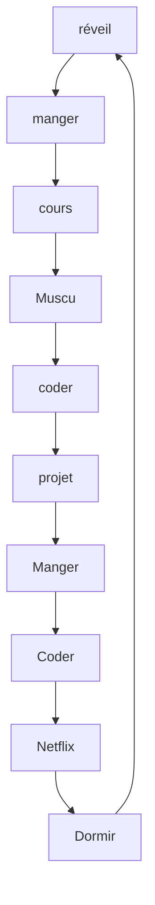

<h1>nac0 | Ugo  </h1>

 Mon prénom est Ugo et j'ai 17 ans. 🙃   
Je travaille comme responsable community et developers sur le serveur SINIXDEV depuis maintenant 1 ans. et demi🪂   
Je suis Développeur depuis maintenant plus de 3 ans ! 🔥

                                      _____                    _____                    _____                   _______         
                                     /\    \                  /\    \                  /\    \                 /::\    \        
                                    /::\____\                /::\    \                /::\    \               /::::\    \       
                                   /::::|   |               /::::\    \              /::::\    \             /::::::\    \      
                                  /:::::|   |              /::::::\    \            /::::::\    \           /::::::::\    \     
                                 /::::::|   |             /:::/\:::\    \          /:::/\:::\    \         /:::/~~\:::\    \    
                                /:::/|::|   |            /:::/__\:::\    \        /:::/  \:::\    \       /:::/    \:::\    \   
                               /:::/ |::|   |           /::::\   \:::\    \      /:::/    \:::\    \     /:::/    / \:::\    \  
                              /:::/  |::|   | _____    /::::::\   \:::\    \    /:::/    / \:::\    \   /:::/____/   \:::\____\ 
                             /:::/   |::|   |/\    \  /:::/\:::\   \:::\    \  /:::/    /   \:::\    \ |:::|    |     |:::|    |
                            /:: /    |::|   /::\____\/:::/  \:::\   \:::\____\/:::/____/     \:::\____\|:::|____|     |:::|    |
                            \::/    /|::|  /:::/    /\::/    \:::\  /:::/    /\:::\    \      \::/    / \:::\    \   /:::/    / 
                             \/____/ |::| /:::/    /  \/____/ \:::\/:::/    /  \:::\    \      \/____/   \:::\    \ /:::/    /  
                                     |::|/:::/    /            \::::::/    /    \:::\    \                \:::\    /:::/    /   
                                     |::::::/    /              \::::/    /      \:::\    \                \:::\__/:::/    /    
                                     |:::::/    /               /:::/    /        \:::\    \                \::::::::/    /     
                                     |::::/    /               /:::/    /          \:::\    \                \::::::/    /      
                                     /:::/    /               /:::/    /            \:::\    \                \::::/    /       
                                    /:::/    /               /:::/    /              \:::\____\                \::/____/        
                                    \::/    /                \::/    /                \::/    /                 ~~              
                                     \/____/                  \/____/                  \/____/                              
                                       _    _    _              _    __ __                 __      __        __
                                      | |_ | |_ | |_  _ __  ___(_)  / // /_ _   __ _  __  /  \    / _| _ _  / /
                                      | ' \|  _||  _|| '_ \(_-< _  / // /| ' \ / _` |/ _|| () |_ |  _|| '_|/ / 
                                      |_||_|\__| \__|| .__//__/(_)/_//_/ |_||_|\__,_|\__| \__/(_)|_|  |_| /_/  
                                                     |_|                                                       

<h1> En fait  </h1>

 ・ 📡 Je travaille actuellement  sur un nouveaux projets ...   
    ・ 🌱 J'apprends chaque jour de nouvelles choses ...  
    ・ 👯 J'aide les gens au quotidien ...   
    ・ 📂 Mon portefolio s'agrandit de jour en jour ...  
    ・ 💎 Pour me joindre : nacopirard@gmail.com ...  
  

  
 <h1> Activité récente sur Github </h1>
 

 ・ very soon
    ・ very soon
    ・ very soon
    ・ very soon
    ・ very soon
   
  

<h1> Mon quotidien </h1>

 

<h1> Mon plus grand kiff </h1>

 ・ 🙃 j'ai postuler pour le moderator academy exam : je croise les doigts pour être accepter (réponse avant le 31 décembre)
  

    🧪 | discord.gg/soon
  

    🔭 | https://www.youtube.com/channel/UCC-t40pbAhyoXQRoRlczKXg

  

    🗞️ | https://www.tiktok.com/@sinixdevofficiel 
 

    🤖 | https://discord.gg/rHBztbN7tn
    
<h1> Statistiques GitHub </h1>
 

    
   
    
