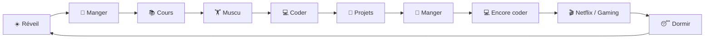

# 👋 Salut, moi c'est Ugo — aka `nac0`

<p align="center">
  <strong>Développeur • FiveM • Java • Python • Unity</strong><br>
  J'aime apprendre, créer des projets et transformer des idées en code.
</p>

---

## 🧑‍💻 À propos de moi

* 🎂 J'ai **19 ans**
* 💻 Passionné par le **développement** et l'informatique
* 🎮 Je développe notamment autour de **FiveM / GTA RP**
* ☕ J'apprends actuellement **Java**
* 🐍 Je développe également mes compétences en **Python**
* 🎮 Je travaille sur différents projets avec **Unity**
* 🧠 J'aime comprendre comment les choses fonctionnent plutôt que simplement copier du code
* 📈 Mon objectif : progresser chaque jour et construire des projets de plus en plus complets
* 📩 Contact : **[nacopirard1@gmail.com](mailto:nacopirard1@gmail.com)**

---

## 🚀 Ce que je fais actuellement

```text
🎮 Développement FiveM
☕ Apprentissage de Java
🐍 Développement Python
🕹️ Projets Unity
🌐 Développement de projets personnels
📚 Apprentissage continu
```

---

## 🛠️ Technologies & outils

<p align="center">


</p>

---

## 🎯 Mes projets

### 🎮 FiveM

Je travaille sur différents projets liés à **FiveM**, notamment :

* développement de scripts
* création et configuration de serveurs
* systèmes RP
* interfaces personnalisées
* création de personnages
* véhicules et fonctionnalités serveur
* bases de données et intégration de ressources

### 🕹️ Unity

Je développe également des projets sous **Unity**, avec notamment :

* déplacements du personnage
* système de stamina
* accroupissement
* gestion de caméra
* sons de déplacement
* interactions et mécaniques de gameplay

### 💻 Programmation

Je continue actuellement à développer mes connaissances en :

```java
public class Ugo {
    public static void main(String[] args) {
        String developer = "nac0";
        boolean learning = true;

        while (learning) {
            System.out.println("Learn. Code. Improve. Repeat.");
        }
    }
}
```

---

## 📊 Statistiques GitHub

<p align="center">


</p>

---

## 🔄 Mon quotidien


```mermaid
graph LR
    A[☀️ Réveil] --> B[🍳 Manger]
    B --> C[📚 Cours]
    C --> D[🏋️ Muscu]
    D --> E[💻 Coder]
    E --> F[🚀 Projets]
    F --> G[🍕 Manger]
    G --> H[💻 Encore coder]
    H --> I[🎬 Netflix / Gaming]
    I --> J[😴 Dormir]
    J --> A
```

---

## ❤️ Un projet qui me tient à cœur

J'ai également eu l'occasion de participer et d'aider autour de projets caritatifs et événementiels, notamment **l'exposition Brickx LEGO® Arlon**.

Un projet mêlant :

🧱 LEGO • 🤝 Solidarité • 🎨 Créativité • 👨‍👩‍👧‍👦 Famille • ❤️ Caritatif

---

## 🎯 Mes objectifs

* 🚀 Développer des projets plus ambitieux
* 🎮 Continuer à progresser dans le développement FiveM
* ☕ Approfondir Java
* 🐍 Maîtriser davantage Python
* 🕹️ Créer des jeux et systèmes plus poussés avec Unity
* 🌐 Construire mon portfolio
* 🧠 Découvrir de nouvelles technologies
* 🤝 Collaborer avec d'autres développeurs

---

## 📫 Me contacter

<p align="center">

### `nac0`

📧 **[nacopirard1@gmail.com](mailto:nacopirard1@gmail.com)**

💻 **GitHub :** [@nac0sensei](https://github.com/nac0sensei)

</p>

---

<p align="center">
  <i>« Learn • Build • Improve • Repeat »</i>
</p>
